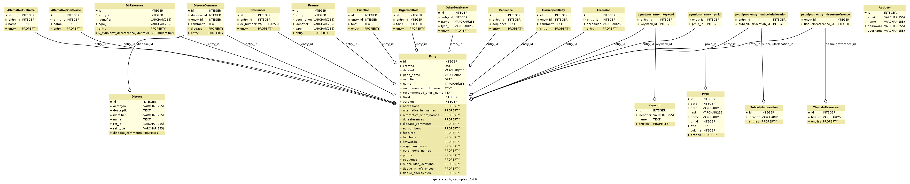

Data Models
===========

`PyUniProt` uses `SQLAlchemy <http://www.sqlalchemy.org/>`_ to store the data in the database.
Use instance of :class:`pyuniprot.manager.query.QueryManager` to query the content of the database.

Entity–relationship model:

.. contents::

Entry
-----

.. autoclass:: pyuniprot.manager.models.Entry
    :members:

Accession
---------

.. autoclass:: pyuniprot.manager.models.Accession
    :members:

OtherGeneName
-------------

.. autoclass:: pyuniprot.manager.models.OtherGeneName
    :members:

Sequence
--------

.. autoclass:: pyuniprot.manager.models.Sequence
    :members:

Disease
-------

.. autoclass:: pyuniprot.manager.models.Disease
    :members:

DiseaseComment
--------------

.. autoclass:: pyuniprot.manager.models.DiseaseComment
    :members:

AlternativeFullName
-------------------

.. autoclass:: pyuniprot.manager.models.AlternativeFullName
    :members:

AlternativeShortName
--------------------

.. autoclass:: pyuniprot.manager.models.AlternativeShortName
    :members:

Accession
---------

.. autoclass:: pyuniprot.manager.models.Accession
    :members:

Pmid
----

.. autoclass:: pyuniprot.manager.models.Pmid
    :members:

OrganismHost
------------

.. autoclass:: pyuniprot.manager.models.OrganismHost
    :members:

DbReference
-----------

.. autoclass:: pyuniprot.manager.models.DbReference
    :members:

Feature
-------

.. autoclass:: pyuniprot.manager.models.Feature
    :members:

Function
--------

.. autoclass:: pyuniprot.manager.models.Function
    :members:

Keyword
-------

.. autoclass:: pyuniprot.manager.models.Keyword
    :members:

ECNumber
--------

.. autoclass:: pyuniprot.manager.models.ECNumber
    :members:

SubcellularLocation
-------------------

.. autoclass:: pyuniprot.manager.models.SubcellularLocation
    :members:

TissueSpecificity
-----------------

.. autoclass:: pyuniprot.manager.models.TissueSpecificity
    :members:

TissueInReference
-----------------

.. autoclass:: pyuniprot.manager.models.TissueInReference
    :members:
